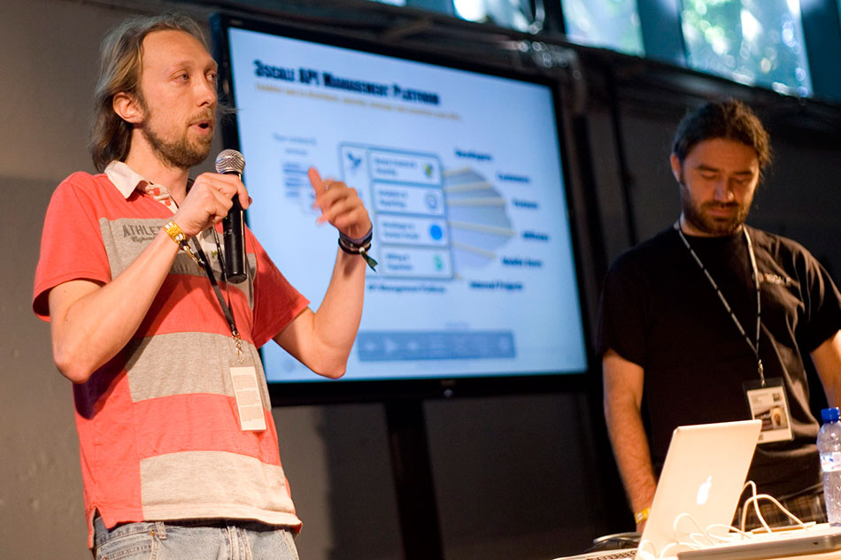
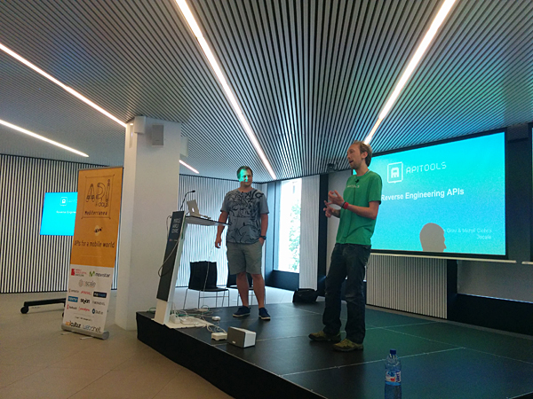

# NAME

	Raimon Grau Cuscó

# VERSION

	32.0
	(first version appeared in 1983)

# SYNOPSIS

	Average Blond guy, with some Lua and Ruby programming
    skills. Emacs devote, and programming languages nerd. Loves Lisp
    and Smalltalk. Quite talkative, and generally good mood.

# DESCRIPTION

- mail: raimonster@gmail.com
- phone: mmmm...not here
- skype: raimon.gra1
- location: Bcn

# FUNCTIONS

## Work

Working [@3scale](http://www.3scale.net)

## Hobbies

- Bass playing
- Skating
- Programming languages
- Party hard

# EXPORTS

    Bass playing, skating, good conversations in English, Catalan or
    Spanish.

# SCREENSHOTS




# SCREENCASTS

## Music
- http://www.youtube.com/user/giftedband?feature=watch

## Others
- http://vimeo.com/user3097987

# DEPENDENCIES

- Coffee 1.0
- Cigarettes 2.0.14

# PITFALLS
	Might not work correctly when not enough sleep or some dependency is missing

# BUGS AND LIMITATIONS

- Can't do frontend

# FEEDBACK

Please, send any feedback as an issue, or via mail.

# SEE ALSO

- [More formal CV](https://github.com/kidd/Me/raw/master/cv/other_cv.pdf)
- http://puntoblogspot.blogspot.com
- http://github.com/kidd

# Changelog

```ChangeLog

2014-XX-XX
  * Release of Apitools (Lua+Nginx+redis+RoR+Docker+whatnot)
  (http://www.apitools.com)
  * Give a talk in ApiDays Barcelona about Reverse Engineering APIs
    with Apitools.
  * Back to RoR application as Team Lead, and focused on backend.
  * Attending Polyconf.
  * Dabbling with clojure a bit more seriously and trying to wrap my
    head around Haskell and Factor.

2013-XX-XX
  * Running Lua embedded in Redis and Nginx. Highly concurrent apps.
  * Attending European Lisp Conference. Madrid
  * Attending Lua Workshop. Toulouse
  * Even a bit more addicted to emacs (and yeah,... lisps)

2012-XX-XX
  * Ror & Lua programming at 3scale. Generating lua code from a Rails
  app to run embedded in Nginx for dynamic routing.
  * More addicted to emacs (and lisp)

2011-XX-XX
  * 2011-07-XX Join 3scale.
    - Ruby development.
    - Getting to know a big Rails app, with high Redis traffic volume.

  * Attending European Smalltalk User Group Conference. Edinburgh
  * Became Emacs Addict (and lisp)

2010-XX-XX
  * 2010-12-X Joined Gnuine. My first experience with Ruby, and
    Rails. Also first contact with web development.
  * Attending European Smalltalk User Group Conference. Barcelona
  * Presented my bachelor's degree final work: "Applying Evolutionary
    Algorithms to drug discovery". Graded A (MH).
  * Stated using emacs

2009-XX-XX
  * Joining Smalltalk.cat.
  * Attending Perl YAPC::EU 2009 Conference.

2008-XX-XX
  * Back to Barcelona. Working at Intelligent Pharma. Developing
    Artificial Intelligence (Machine Learning and Evolutionary
    Algorithms) applications for drug discovery.  Developing in Perl.
  * Joining Barcelona Perl Mongers
  * Joined Github (as a user :D) (Sep 21, 2008)

2007-XX-XX
  * Moved from Barcelona to Tenerife
  * First patches in free software. (vimperator)
  * Developed a few apps for Vectorlinux distribution which are still
    used in the distro.

2003-XX-XX
  * Workingat AMES S.L.
    - Programming in Dataflex, Perl, and CrystalReports
  * Became Vim addict

2001-XX-XX
  * Uni

1983-04-12
  * First commit
```

# AUTHORs
	Josep Grau
	Teresa Cuscó

# COPYRIGHT AND LICENSE

- WTFPL - http://www.wtfpl.net/
- Artistic License 2.0 - http://www.perlfoundation.org/artistic_license_2_0
